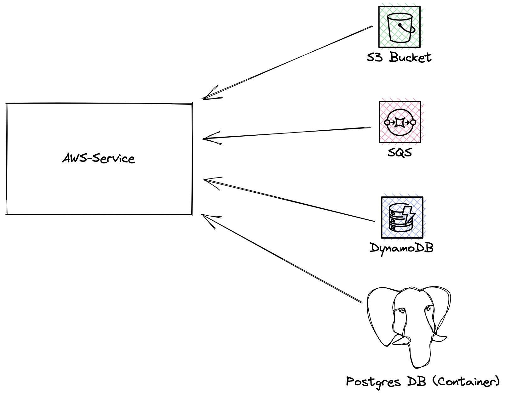

# AWS Helm Sample

### What is being deployed?
Here we deploy AWS-service and all of it's dependencies, as shown in the following chart:



[AWS-Service](../../../references/aws-service) is a reference service that is used to act as an example application in AWS environments.

AWS-Service depends on and uses the following services:
1. S3 bucket
2. SQS queue
3. DynamoDB Table
4. PostgreSQL Database (Runs as a container and not as a cloud managed service)


### HOWTO Dry run

To dry run the helm chart for prod environment, run the following command:
```shell
helm template --values values-prod.yaml . > prod.yaml
```
This mimics how you would install the helm chart in prod env.

To dry run the helm chart for velocity environments, run the following command:
```shell
helm template --set provision_resources=true --values values-velocity.yaml . > velocity.yaml
```


### TODO

Add instructions on how to run the Blueprint applyer.
