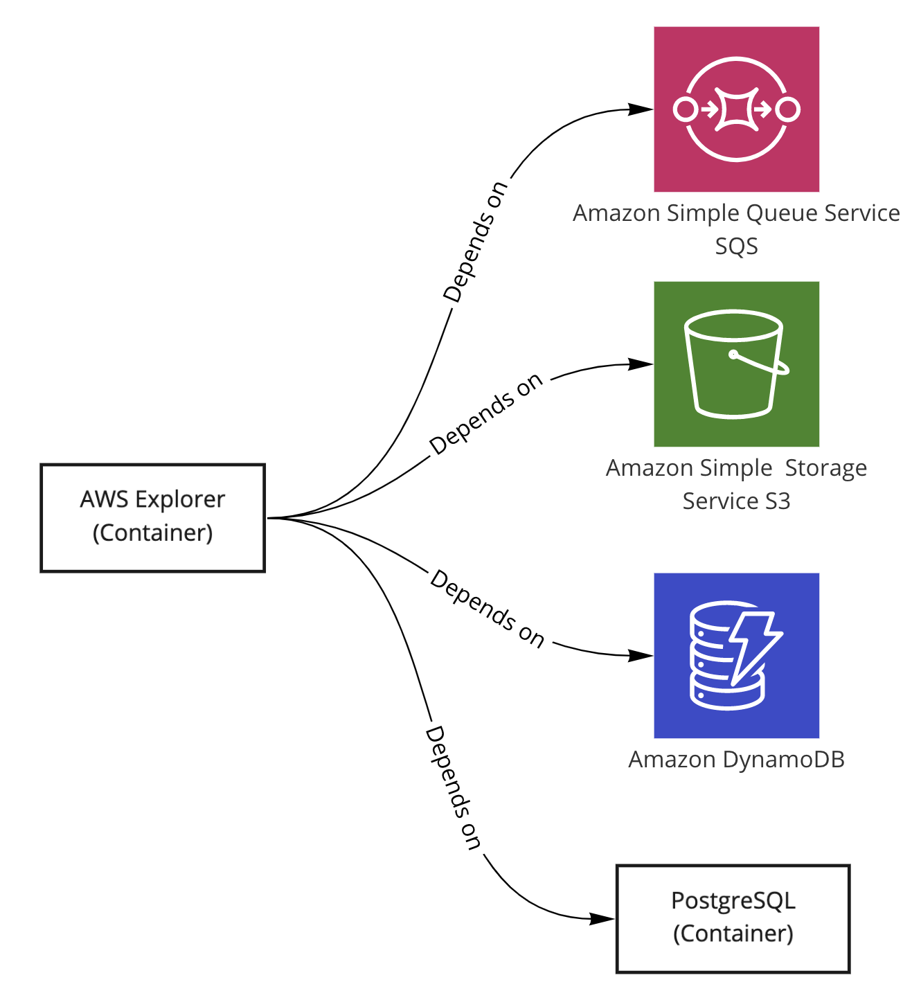

# AWS Helm Sample

### What is being deployed?
Here we deploy AWS-Explorer and all of its dependencies, as shown in the following chart:



[AWS-Explorer](../../../references/aws-explorer) is a reference service that is used to act as an example application in AWS environments.

AWS-Explorer depends on and uses the following services:
1. [S3 bucket](templates/s3.yaml) (Runs as an actual cloud resource)
2. [SQS queue](templates/sqs.yaml) (Runs as an actual cloud resource)
3. [DynamoDB Table](templates/dynamodb.yaml) (Runs as an actual cloud resource)
4. [PostgreSQL Database](templates/postgresql.yaml) (Runs as a container and not as a cloud managed service)
   1. The k8s manifest code for PostgreSQL was taken from the [reference snippet](../../../references/kubernetes/database-containers/postgresql.yaml).
5. [DB Migration Seeding Job](templates/seeding.yaml)
   1. Because our app expects a certain DB schema that it can work with, we need to apply DB schema migration scripts.
   2. This k8s seeding Job runs DB migration scripts against the PostgreSQL DB.
   3. A k8s job will run once (considering it finished successfully) just after the PostgreSQL DB has started, and before the application has started.
   4. The migrations scripts it executes can be seen in [/references/db-migrations](../../../references/db-migrations)

The k8s manifest code is available under the [templates](templates) directory.

### Helm

`velues-prod.yaml` is the file the contains the values that fit your production environment.

`values-velocity.yaml` is the file the contains the values that fit your velocity environments.


### HOWTO Dry run

To dry run the helm chart for prod environment, run the following command:
```shell
helm template --values values-prod.yaml . > prod.yaml
```
This mimics how you would install the helm chart in prod env.

To dry run the helm chart for velocity environments, run the following command:
```shell
helm template --set provision_resources=true --values values-velocity.yaml . > velocity.yaml
```


### TODO

Add instructions on how to run the Blueprint applyer.
