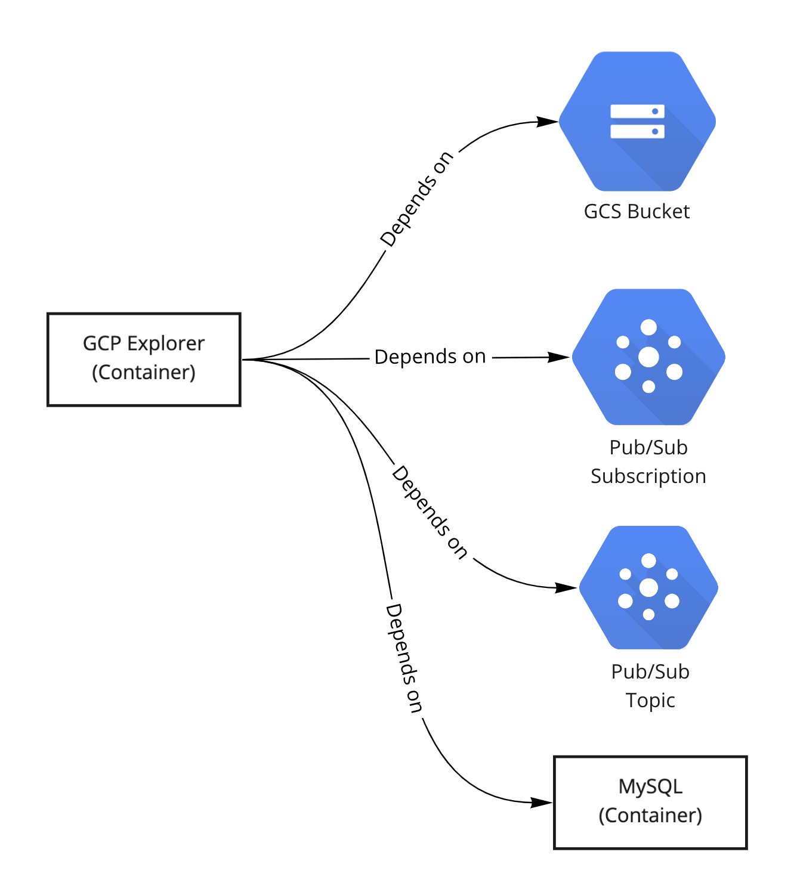

# GCP Helm Sample

### What is being deployed?
Here we deploy GCP-Explorer and all of it's dependencies, as shown in the following chart:



[GCP-Explorer](../../../references/gcp-explorer) is a reference service that is used to act as an example application in GCP environments.

GCP-Explorer depends on and uses the following services:
1. [GCS Bucket](templates/gcs.yaml)
2. [Pub/Sub Topic](templates/pubsub.yaml)
3. [Pub/Sub Subscription](templates/pubsub.yaml) (Attached to the Topic)
4. [MySQL Database](templates/mysql.yaml) (Runs as a container and not as a cloud managed service)
    1. The k8s manifest code for MySQL was taken from the [reference snippet](../../../references/kubernetes/database-containers/mysql.yaml).

The k8s manifest code is available under the [templates](templates) directory.


### Helm

`velues-prod.yaml` is the file the contains the values that fit your production environment.

`values-velocity.yaml` is the file the contains the values that fit your velocity environments.


### HOWTO Dry run

To dry run the helm chart for prod environment, run the following command:
```shell
helm template --values values-prod.yaml . > prod.yaml
```
This mimics how you would install the helm chart in prod env.

To dry run the helm chart for velocity environments, run the following command:
```shell
helm template --set provision_resources=true --values values-velocity.yaml . > velocity.yaml
```


### TODO

Add instructions on how to run the Blueprint applyer.
