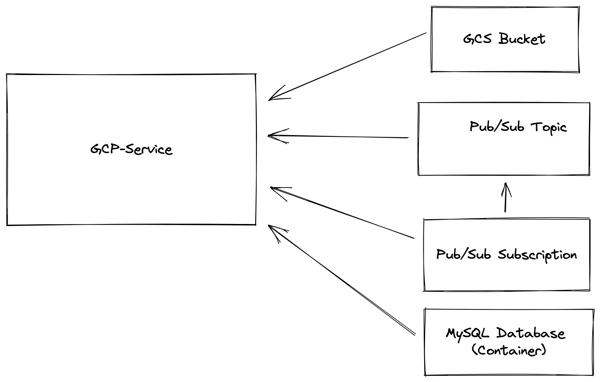

# GCP Helm Sample

### What is being deployed?
Here we deploy GCP-service and all of it's dependencies, as shown in the following chart:



[GCP-Service](../../../references/gcp-service) is a reference service that is used to act as an example application in GCP environments.

GCP-Service depends on and uses the following services:
1. GCS Bucket
2. Pub/Sub Topic
3. Pub/Sub Subscription (Attached to the Topic)
4. MySQL Database (Runs as a container and not as a cloud managed service)


### Helm

`velues-prod.yaml` is the file the contains the values that fit your production environment.

`values-velocity.yaml` is the file the contains the values that fit your velocity environments.


### HOWTO Dry run

To dry run the helm chart for prod environment, run the following command:
```shell
helm template --values values-prod.yaml . > prod.yaml
```
This mimics how you would install the helm chart in prod env.

To dry run the helm chart for velocity environments, run the following command:
```shell
helm template --set provision_resources=true --values values-velocity.yaml . > velocity.yaml
```


### TODO

Add instructions on how to run the Blueprint applyer.
