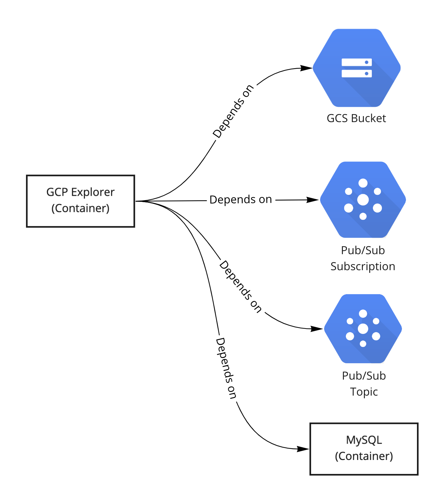

# gcp/sample-k8s

### What is being deployed?
Here we deploy GCP-Explorer and all of it's dependencies, as shown in the following chart:

[GCP-Explorer](../../../references/gcp-explorer) is a reference service that is used to act as an example application in GCP environments.

The k8s manifest code is available under this directory and consists of:
1. [GCP-Explorer](explorer.yaml) which is the example application. It depends on:
    1. [GCS Bucket](gcs.yaml) (Runs as an actual cloud resource)
    2. [Pub/Sub Topic](pubsub.yaml) (Runs as an actual cloud resource)
    3. [Pub/Sub Subscription](pubsub.yaml) (Runs as an actual cloud resource - Attached to the Topic)
    4. [MySQL Database](mysql.yaml) (Runs as a container and not as a cloud managed service)
        1. The k8s manifest code for MySQL was taken from the [reference snippet](../../../references/kubernetes/common-containers/mysql.yaml).

