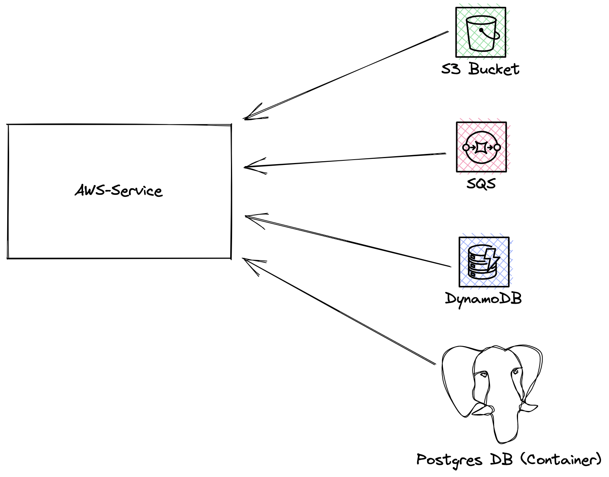

# aws-service

 

AWS-Service is a reference service that is used to act as an example application in AWS environments.

AWS-Service depends on and uses the following services:
1. S3 bucket
2. SQS queue
3. DynamoDB Table
4. PostgreSQL Database (Runs as a container and not as a cloud managed service)

